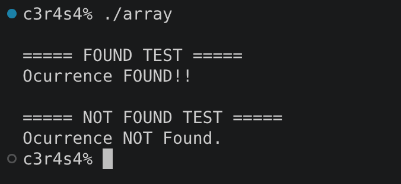
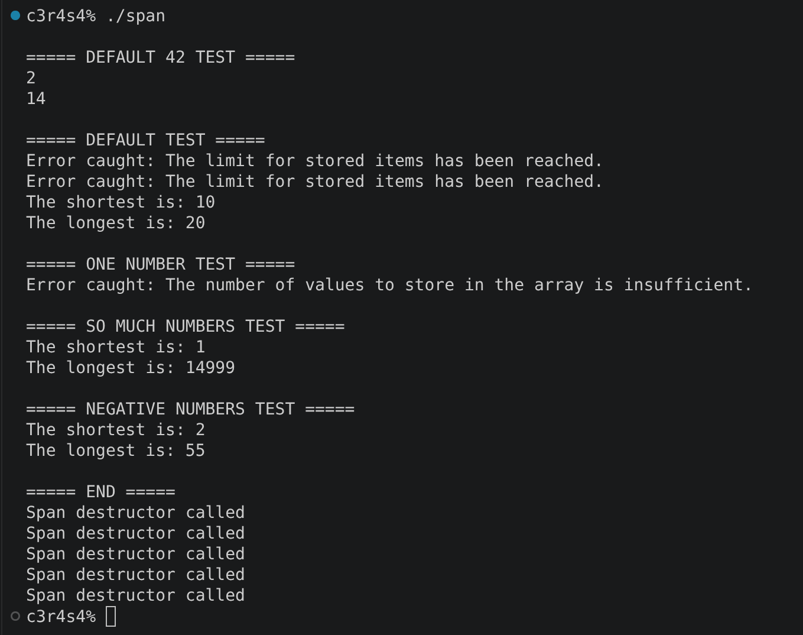
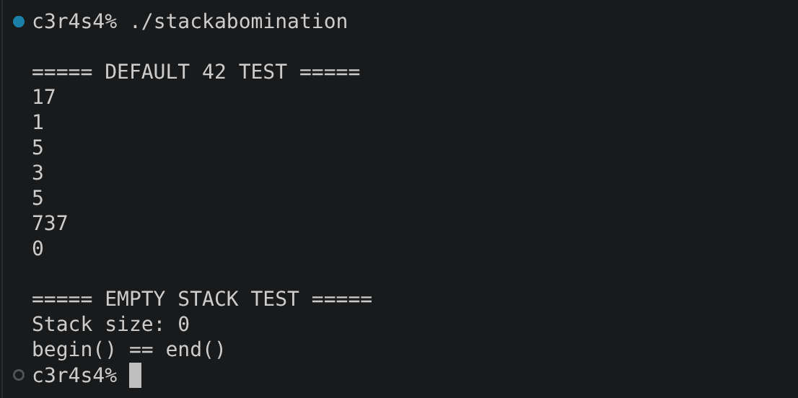

# cpp_module_08

### Clarifications and general tips:

* If you find any kind of error or have suggestions to improve, please do not hesitate to point them out in the `issues` section! Obviously always respectfully, thank you :D.
* Always remember that the output examples are just examples. They can vary in your own project and still be fine.
* This module introduces *the STL library*, do an investigation before starting the exercises, focusing especially on **containers** and **algorithms**.

## ex00: Easy find

### Mandatory requirements completed:

* Implement a function template `easyfind` that:
  * Receives a type `T`.
  * Takes a "container of integers" as its first parameter and an integer as its second parameter.
  * Finds the first occurrence of that integer in the container.
  * Throws an exception or returns an error value when the occurrence is not found.
* The exercise uses the STL containers and algorithms appropriately.

### What can we learn about this exercise?:

This exercise introduces the use of **STL containers, iterators and algorithms** through a function template that searches for an integer inside a generic container.

### Output example:

## ex01: Span

### Mandatory requirements completed:

* Create a class `Span` that:
  * Stores a maximum of `N` (`unsigned int`) integers. Been `N` the only parameter in its constructor.
  * Has implemented an `addNumber()` member function to add a single number to the Span object. And after reaching the maximum capacity of the object it throws an exception.
  * Has implemented `shortestSpan()` to find the shortest distance between each one of the stored numbers.
  * Has implemented `longestSpan()` to find the longest distance between each one of the stored numbers.
  * Throws an exception when there are fewer than two numbers stored (less or equal that one).
* Implement a member function (`addSomeNumbers`) that allows filling the `Span` using a range of iterators.
* Test the class with at least 10,000 numbers.

### What can we learn about this exercise?:

This exercise focuses deeper on **STL containers, iterators and algorithms**, while working with a class that stores a limited number of integers and calculates distances between them.

### Output example:

## ex02: Mutated abomination

### Mandatory requirements completed:

* Create a `MutantStack` class implemented in terms of `std::stack`. The class must offer:
  * All the member functions provided by `std::stack`.
  * Additional iterator support (adding functions like `begin()` and `end()` from the stack internal container that is iterable).
* The behavior of the `MutantStack` should produce the same output as the equivalent test using another iterable STL container, such as `std::list`.

### What can we learn about this exercise?:

This exercise introduces **STL container adapters and iterators**, extending `std::stack` with iterator functionality while keeping its existing interface.

### Output example:

#### Last but not least, check out these other repositories if you feel lost, they helped me a lot through the project:

ex02, hay dos main pero debe de funcionar con los dos

https://github.com/deryaxacar/42-CPP-Module-08

https://github.com/Ysoroko/cpp_module_08/blob/master/ex01/span.hpp